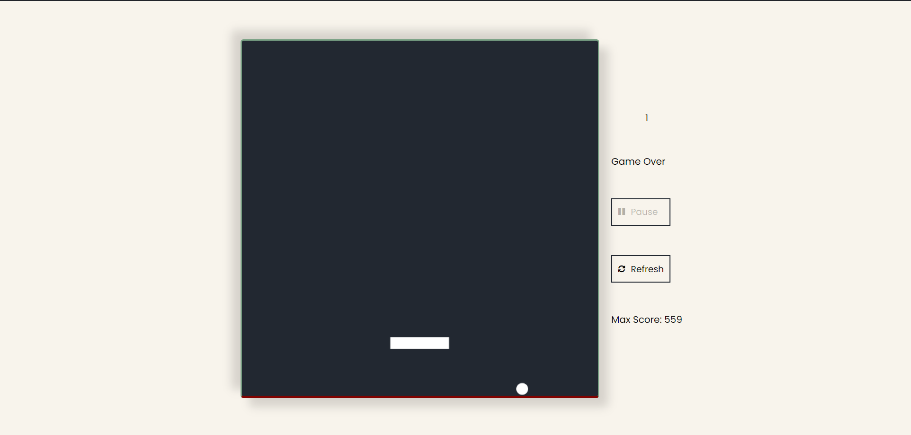
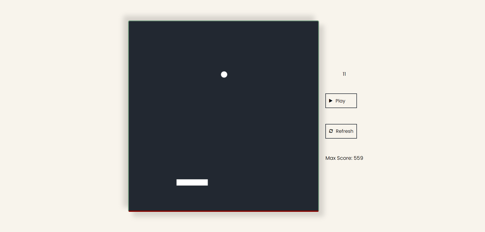

# Bouncing Ball Game

A simple bouncing ball game implemented using HTML, CSS, and JavaScript. This project was created as a school assignment to practice working with the HTML5 Canvas element and JavaScript classes.

## How to Play

- Use the left and right arrow keys to move the paddle.
- Keep the ball bouncing by hitting it with the paddle.
- Avoid letting the ball fall off the bottom of the screen.

## Screenshots


*Screenshot of the gameplay*


*Screenshot of the game over screen*

## Installation

1. Clone this repository:
   ```bash
   git clone https://github.com/ismaildrs/bouncing-ball-game.git
